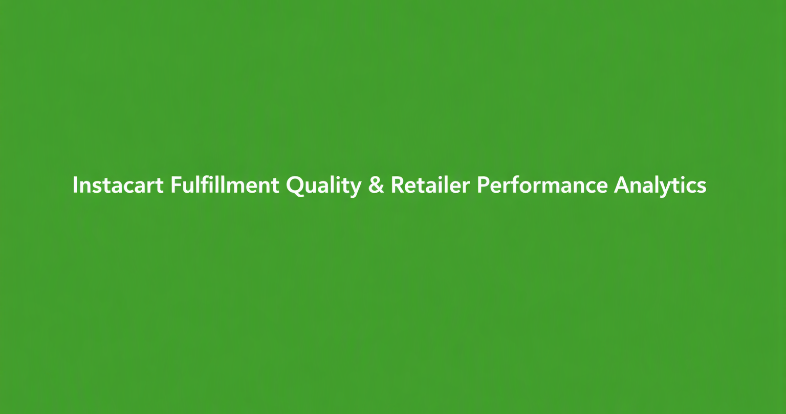

# Instacart Fulfillment Quality & Retailer Performance Analytics


## Overview
This project simulates the type of work done by a Data Analyst on Instacart's Platform Excellence Ops (PEO) Analytics team. It focuses on:

- Fulfillment quality metrics (cancellations, reschedules, timeliness)
- Retailer performance monitoring
- Anomaly detection and root-cause analysis
- Proactive performance tracking and escalation support
- Clear, stakeholder-ready insights and narratives

The goal is to demonstrate an end-to-end analytics workflow:

- Data design and ingestion  
- Cleaning, validation, and reconciliation  
- Metric definition and calculation  
- Anomaly detection and performance fluctuation analysis  
- Insight generation and recommendations  

---

## Project Structure

├── data/
│   ├── orders.csv
│   ├── retailers.csv
│   └── escalations.csv
│
├── notebooks/
│   └── retailer_quality_analysis.ipynb
│
├── sql/
│   └── retailer_quality_metrics.sql
│
├── outputs/
│   └── retailer_quality_metrics.csv
│
├── assets/
│   └── banner.png
│
└── README.md


---

## Data Model

### 1. orders.csv
- order_id  
- order_date  
- retailer_id  
- region  
- promised_delivery_time  
- actual_delivery_time  
- status  
- cancellation_reason  
- reschedule_reason  
- basket_size  
- order_value  
- shopper_id  

### 2. retailers.csv
- retailer_id  
- retailer_name  
- region  
- launch_date  
- tier  

### 3. escalations.csv
- escalation_id  
- order_id  
- retailer_id  
- created_at  
- escalation_type  
- severity  
- resolved_at  

---

## Key Metrics

### Fulfillment Quality Metrics

**Cancellation Rate**  


\[
\text{Cancellation Rate} = \frac{\text{Cancelled Orders}}{\text{Total Orders}}
\]


**Reschedule Rate**  


\[
\text{Reschedule Rate} = \frac{\text{Rescheduled Orders}}{\text{Total Orders}}
\]


**On-Time Delivery Rate**  


\[
\text{On-Time Rate} = \frac{\text{Orders Delivered On or Before Promised Time}}{\text{Completed Orders}}
\]


**Escalation Rate**  


\[
\text{Escalation Rate} = \frac{\text{Orders with Escalations}}{\text{Total Orders}}
\]


---

## Retailer Performance Metrics
Calculated per retailer and per region:

- Cancellation rate  
- Reschedule rate  
- On-time delivery rate  
- Escalation rate  
- Average order value  
- Basket size distribution  

---

## SQL Workflow (Outline)

File: `sql/retailer_quality_metrics.sql`

```sql
WITH base AS (
    SELECT
        o.order_id,
        o.order_date,
        o.retailer_id,
        r.retailer_name,
        r.region,
        o.status,
        o.promised_delivery_time,
        o.actual_delivery_time,
        o.order_value
    FROM orders o
    JOIN retailers r
        ON o.retailer_id = r.retailer_id
)
